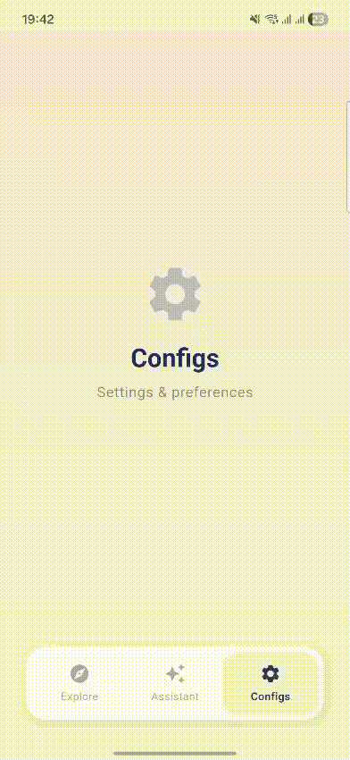

# Hybrid Tab Bar

[](https://pub.dev/packages/hybrid_tab_bar)
[](https://opensource.org/licenses/BSD-3-Clause)
[](https://flutter.dev)
[](https://dart.dev)

A glassmorphism **hybrid navigation system** for Flutter — featuring an animated segmented control and floating bottom navigation bar inside a unified glass container.

Inspired by the [Dribbble reference](https://dribbble.com/shots/27143363-Hybrid-Tab-Bar-Segmented-Control).

---

## 📸 Demo

<p align="center">
  
</p>

---

## ✨ Features

| Feature                        | Description                                                                         |
| ------------------------------ | ----------------------------------------------------------------------------------- |
| 🔮 **Glassmorphism**           | Backdrop blur, semi-transparent tint, 1px inner stroke, neumorphic dual shadows     |
| 🎯 **Per-item segmented tabs** | Each bottom nav item can optionally have its own set of sub-tabs                    |
| 💫 **Smooth animations**       | Sliding pill indicators with configurable curves and durations                      |
| 🃏 **Card-within-card design** | Bottom nav sits inside its own distinct inner card within the outer glass container |
| 📐 **Animated show/hide**      | Segmented control slides in/out with `AnimatedSize` + `AnimatedOpacity`             |
| 🎨 **25+ style properties**    | Colors, radii, blur, shadows, text styles, animations — all configurable            |
| 🌓 **Light & Dark presets**    | `HybridTabStyle.light` and `HybridTabStyle.dark` out of the box                     |
| ♿ **Accessible**              | Full `Semantics` labels on all interactive elements                                 |
| 📳 **Haptic feedback**         | Optional `HapticFeedback.lightImpact()` on bottom nav taps                          |
| 📦 **Zero dependencies**       | Only the Flutter SDK                                                                |

---

## 📦 Installation

### From `pub.dev` or Add to your `pubspec.yaml` file

```yaml
dependencies:
  hybrid_tab_bar: ^1.0.0
```

Then run:

```bash
flutter pub get
```

---

## 🚀 Quick Start

```dart
import 'package:flutter/material.dart';
import 'package:hybrid_tab_bar/hybrid_tab_bar.dart';

class MyApp extends StatelessWidget {
  @override
  Widget build(BuildContext context) {
    return MaterialApp(
      home: HybridTabBarScaffold(
        backgroundColor: const Color(0xFFF0F2F8),
        style: HybridTabStyle.light,
        bottomItems: const [
          // This item HAS segmented sub-tabs
          HybridNavItem(
            icon: Icons.explore,
            label: "Explore",
            segmentedTabs: ["Rooms", "Inspiration", "Profiles"],
          ),
          // These items have NO sub-tabs
          HybridNavItem(icon: Icons.auto_awesome, label: "Assistant"),
          HybridNavItem(icon: Icons.settings, label: "Configs"),
        ],
        bodyBuilder: (bottomIndex, segmentedIndex) {
          // bottomIndex  → which bottom nav item is active (0, 1, 2)
          // segmentedIndex → which sub-tab is active (0, 1, 2) if applicable
          return Center(
            child: Text("Bottom: $bottomIndex, Segment: $segmentedIndex"),
          );
        },
      ),
    );
  }
}
```

### How it works

1. **Tap "Explore"** → segmented tabs ("Rooms", "Inspiration", "Profiles") slide into view inside the glass container
2. **Tap "Assistant" or "Configs"** → segmented tabs smoothly animate away, leaving only the bottom nav card
3. **Switch sub-tabs** within "Explore" → the segmented pill slides to the selected tab

---

## 🎨 Customization

### HybridTabStyle

Every visual aspect is configurable through `HybridTabStyle`:

```dart
HybridTabStyle(
  // Colors
  activeColor: Color(0xFF2B3A67),         // Active text/icon color
  inactiveColor: Color(0xFF7A8A9E),       // Inactive text/icon color
  glassTint: Color(0xFFE8ECF2),           // Glass container background tint
  segmentedPillColor: Color(0xFFD6DAE8),  // Segmented control pill color
  bottomPillColor: Color(0xFFECEEF4),     // Bottom nav pill color

  // Glass effect
  blurAmount: 20.0,                       // Backdrop blur sigma
  glassTintOpacity: 0.55,                 // Glass tint opacity
  glassBorderOpacity: 0.40,               // Inner border stroke opacity
  enableBlur: true,                       // Toggle blur (for performance)

  // Border radii
  outerBorderRadius: 28.0,               // Outer glass container
  segmentedPillRadius: 14.0,             // Segmented pill
  bottomPillRadius: 18.0,               // Bottom nav pill

  // Animations
  pillAnimationDuration: Duration(milliseconds: 400),
  iconAnimationDuration: Duration(milliseconds: 300),
  animationCurve: Curves.easeInOutCubic,

  // Behavior
  inactiveOpacity: 0.70,                 // Inactive item opacity
  enableHaptics: true,                   // Haptic feedback on tap

  // Custom shadows
  containerShadowLight: BoxShadow(...),  // Top-left highlight
  containerShadowDark: BoxShadow(...),   // Bottom-right shadow

  // Custom text styles
  activeSegmentedLabelStyle: TextStyle(...),
  segmentedLabelStyle: TextStyle(...),
  activeBottomLabelStyle: TextStyle(...),
  bottomLabelStyle: TextStyle(...),
)
```

### Presets

```dart
// Light theme (matches Dribbble reference)
HybridTabStyle.light

// Dark theme
HybridTabStyle.dark

// Customize from a preset
HybridTabStyle.light.copyWith(
  blurAmount: 30,
  enableHaptics: true,
  activeColor: Colors.indigo,
)
```

---

## 🎮 Controller

Use `HybridTabController` for programmatic navigation:

```dart
// Create controller
final controller = HybridTabController(bottomLength: 3);

// Navigate
controller.setBottomIndex(1);     // Switch bottom nav (resets segmented to 0)
controller.setSegmentedIndex(2);  // Switch segmented sub-tab

// Listen for changes
controller.addListener(() {
  print('Bottom: ${controller.bottomIndex}');
  print('Segment: ${controller.segmentedIndex}');
});

// Use with scaffold
HybridTabBarScaffold(
  controller: controller,
  bottomItems: [...],
  bodyBuilder: (bottom, segment) => ...,
)

// Don't forget to dispose
controller.dispose();
```

---

## 🧩 Standalone Widgets

You can use the segmented control and bottom bar independently:

### HybridSegmentedControl

```dart
HybridSegmentedControl(
  tabs: ["Tab 1", "Tab 2", "Tab 3"],
  currentIndex: 0,
  onTabChanged: (index) => print(index),
  style: HybridTabStyle.light,
  showContainer: true,  // Wraps in its own glass container
)
```

### HybridBottomBar

```dart
HybridBottomBar(
  items: [
    HybridNavItem(icon: Icons.home, label: "Home"),
    HybridNavItem(icon: Icons.search, label: "Search"),
    HybridNavItem(icon: Icons.person, label: "Profile"),
  ],
  currentIndex: 0,
  onItemTapped: (index) => print(index),
  style: HybridTabStyle.light,
  showContainer: true,  // Wraps in external glass container
)
```

---

## 📐 HybridNavItem

```dart
HybridNavItem(
  icon: Icons.explore,              // Default icon
  activeIcon: Icons.explore,        // Optional active icon override
  label: "Explore",                 // Label below icon
  semanticLabel: "Explore section", // Optional accessibility label
  segmentedTabs: [                  // Optional sub-tabs (null = no sub-tabs)
    "Rooms",
    "Inspiration",
    "Profiles",
  ],
)
```

---

## 🏗️ Architecture

```
lib/
├── hybrid_tab_bar.dart            # Barrel exports
└── src/
    ├── controller.dart            # HybridTabController (dual-index ChangeNotifier)
    ├── nav_item.dart              # HybridNavItem data class
    ├── styles.dart                # HybridTabStyle (25+ properties, presets)
    ├── animations.dart            # Duration & curve constants
    ├── segmented_control.dart     # Glassmorphism segmented control widget
    ├── bottom_bar.dart            # Floating bottom nav with inner card
    └── scaffold.dart              # HybridTabBarScaffold (unified container)
```

### Key Design Decisions

- **No `TabBar` / `BottomNavigationBar`** — Fully custom implementation for total control
- **Card-within-card** — The bottom nav has its own distinct inner container inside the outer glass
- **`BackdropFilter`** — Configurable via `enableBlur` flag for performance on low-end devices
- **`RepaintBoundary`** + **`AnimatedBuilder`** — Optimized rebuilds
- **Dual neumorphic shadows** — Light highlight (top-left) + dark shadow (bottom-right) matching the reference
- **`Semantics`** labels — On all interactive elements for accessibility

---

## 🧪 Running Tests

```bash
cd hybrid_tab_bar
flutter test
```

---

## 📄 Example

A complete working example is available in the [`example/`](example/) directory.

```bash
cd example
flutter run
```

---

## 🤝 Contributing

Contributions are welcome! Please feel free to submit a Pull Request.

1. Fork the repo
2. Create your feature branch (`git checkout -b feature/amazing-feature`)
3. Commit your changes (`git commit -m 'Add amazing feature'`)
4. Push to the branch (`git push origin feature/amazing-feature`)
5. Open a Pull Request

---

## 📝 License

This project is licensed under the MIT License — see the [LICENSE](LICENSE) file for details.

---

## 🙏 Credits

- Design inspired by [Dribbble — Hybrid Tab Bar / Segmented Control](https://dribbble.com/shots/27143363-Hybrid-Tab-Bar-Segmented-Control)
- Built with ❤️ by [Samarth Garge](https://github.com/SamarthGarge)
